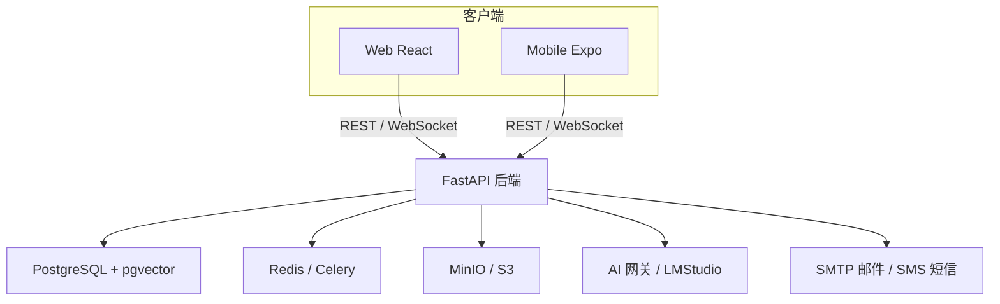

# UniMatch 校园同学匹配交友平台

> 一体化校园匹配平台：Web + 后端（FastAPI）+ 移动端（Expo）。支持同学发现、好友匹配、聊天、留言板、AI 匹配解释与进阶问卷生成。

---

## 目录

- [项目概述](#项目概述)
- [架构](#架构)
- [目录结构](#目录结构)
- [技术栈](#技术栈)
- [ prerequisites](#prerequisites)
- [快速开始](#快速开始)
  - [Docker Compose 一键启动](#docker-compose-一键启动)
  - [后端](#后端)
  - [Web 前端](#web-前端)
  - [移动端（Expo）](#移动端expo)
- [环境变量](#环境变量)
- [AI 配置](#ai-配置)
- [邮件与短信配置](#邮件与短信配置)
- [问卷与匹配说明](#问卷与匹配说明)
- [贡献指南](#贡献指南)
- [部署说明](#部署说明)
- [许可证与合规](#许可证与合规)

---

## 项目概述

UniMatch 面向高校学生，提供三个主要板块：

- **学术（academic）**：匹配研究方向、专业、学术兴趣相近的同学。
- **日常（daily）**：基于兴趣、MBTI、位置等发现志同道合的朋友。
- **交友（dating）**：填写交友问卷、个人画像，获得推荐与匹配解释。

核心功能包括：

- 邮箱/手机验证码注册与登录（JWT + Refresh Token），默认优先学校邮箱白名单
- 个人资料与头像管理
- 三板块发现与推荐系统
- 好友申请、聊天（WebSocket + REST 备用）与留言板
- 问卷系统（可扩展题库）
- AI 进阶问题生成与匹配解释（OpenAI SDK 兼容网关）
- 管理后台用于用户、举报、审核日志管理

---

## 架构



- **API 网关**：FastAPI 提供统一认证、业务接口与 WebSocket 聊天。
- **数据层**：PostgreSQL（含 `pgvector` 扩展）用于结构化数据与向量检索；Redis 用于会话、缓存、限流与 Celery 任务队列；MinIO 用于对象存储。
- **AI 层**：通过 OpenAI SDK 兼容接口接入多个 AI provider，默认调用逻辑见 `services/ai`。
- **异步任务**：Celery + Redis 处理短信、邮件、内容审核、匹配计算等耗时任务。

---

## 目录结构

```
.
├── apps
│   ├── web/                  # React + Vite + TypeScript 前端
│   └── mobile/               # Expo (React Native) 移动端
├── services
│   ├── backend/              # FastAPI + SQLAlchemy + Alembic 后端
│   └── ai/                   # AI 网关配置与本地模型训练说明
├── infra
│   └── docker-compose.yml    # PostgreSQL + Redis + MinIO
├── docs
│   └── API_CONTRACT.md       # 前后端/移动端统一 API 契约
├── .github/workflows/ci.yml  # GitHub Actions CI
├── .env.example              # 全局环境变量模板
├── CONTRIBUTING.md           # 贡献指南
└── README.md
```

---

## 技术栈

- **后端**：Python 3.11 + FastAPI + SQLAlchemy 2.0 + Alembic + Pydantic v2 + Celery + Redis + PostgreSQL（pgvector）+ MinIO
- **前端**：React 18 + Vite + TypeScript + Tailwind CSS + TanStack Query + React Router + Zustand
- **移动端**：Expo + React Native + TypeScript + Zustand
- **AI**：OpenAI SDK 兼容网关，支持 DeepSeek / Kimi / LMStudio / OpenCode / MIMO
- **运维**：Docker Compose、GitHub Actions CI

---

## 前提条件

- Python 3.11+
- Node.js 18+ + npm
- Docker + Docker Compose
-（可选）Expo Go 或本地模拟器用于移动开发

---

## 快速开始

### 1. 克隆仓库并配置环境

```bash
git clone https://github.com/tzhazuma/STUMatch.git
cd STUMatch
cp .env.example .env
# 编辑 .env，填入数据库、邮箱、AI API Key 等
```

### 2. Docker Compose 一键启动基础设施

```bash
docker compose -f infra/docker-compose.yml up -d
```

启动 PostgreSQL（pgvector）、Redis、MinIO。默认端口：

- PostgreSQL：`5432`
- Redis：`6379`
- MinIO API：`9000`
- MinIO Console：`9001`

### 3. 后端

```bash
python3 -m venv .venv
source .venv/bin/activate
pip install -r services/backend/requirements.txt

cd services/backend
alembic upgrade head
# 或者初始化数据库与问卷
python -c "import asyncio; from unimatch.database import init_db; from unimatch.main import seed_questionnaires; asyncio.run(init_db()); asyncio.run(seed_questionnaires())"

uvicorn unimatch.main:app --reload --host 0.0.0.0 --port 8000
```

运行测试：

```bash
cd services/backend
pytest
```

### 4. Web 前端

```bash
cd apps/web
cp .env.example .env
npm install
npm run dev
```

默认访问 http://localhost:5173。

### 5. 移动端（Expo）

```bash
cd apps/mobile
cp .env.example .env
npm install
npx expo start
```

使用 Expo Go 扫描二维码，或按 `i` / `a` 启动 iOS / Android 模拟器。

---

## 环境变量

详见 `.env.example`。关键变量说明：

| 类别 | 变量 | 说明 |
|------|------|------|
| 应用 | `APP_NAME` | 应用名称 |
| 认证 | `SECRET_KEY` | JWT 签名密钥，启动前必须设置，至少 32 位随机字符串 |
| 认证 | `ALLOWED_EMAIL_DOMAINS` | 允许注册的邮箱后缀，多个用逗号分隔，默认 `shanghaitech.edu.cn` |
| 数据库 | `DATABASE_URL` | PostgreSQL async 连接串 |
| 缓存 | `REDIS_URL` | Redis 连接串 |
| 文件存储 | `STORAGE_PROVIDER` | `minio` 或 `s3` |
| 文件存储 | `MINIO_ENDPOINT` / `MINIO_ACCESS_KEY` / `MINIO_SECRET_KEY` | MinIO 配置 |
| 邮件 | `MAIL_PROVIDER` | `netease_126` / `shanghaitech` / `mock` |
| 短信 | `SMS_PROVIDER` | `mock` / `twilio` / `aliyun` / `tencent` |
| AI | `DEFAULT_AI_PROVIDER` | 默认 AI provider |
| AI | `DEEPSEEK_API_KEY` / `KIMI_API_KEY` / ... | 各 provider 密钥 |
| 任务队列 | `CELERY_BROKER_URL` / `CELERY_RESULT_BACKEND` | Celery 配置 |

---

## AI 配置

UniMatch 使用 OpenAI SDK 兼容的抽象层，支持以下 provider：

- **DeepSeek**：`DEEPSEEK_API_KEY`
- **Kimi**：`KIMI_API_KEY`
- **LMStudio**：本地运行 `lms` 后，设置 `LMSTUDIO_BASE_URL=http://localhost:1234/v1`
- **OpenCode**：`OPENCODE_API_KEY`（URL 与模型名待确认）
- **MIMO**：`MIMO_API_KEY`（URL 与模型名待确认）

通过 `DEFAULT_AI_PROVIDER` 选择默认 provider。AI 用于：

- 生成进阶匹配问卷问题
- 生成匹配解释（match explanation）
- 内容审核辅助（可选）

本地模型微调说明见 `services/ai/README.md`。

---

## 邮件与短信配置

### 邮件

开发环境默认 `MAIL_PROVIDER=mock`，验证码会打印在后端控制台。

- **126 邮箱**：`MAIL_PROVIDER=netease_126`，填写 `NETEASE126_*` 变量。
- **上海科技大学邮箱**：`MAIL_PROVIDER=shanghaitech`，校外需要连接校园 VPN，填写 `SHANGHAITECH_*` 变量。

### 短信

开发环境默认 `SMS_PROVIDER=mock`，验证码会打印在控制台。

生产可切换为：

- **Twilio**：填写 `TWILIO_*` 变量。
- **阿里云**：填写 `ALIYUN_*` 变量。
- **腾讯云**：填写 `TENCENT_*` 变量。

---

## 问卷与匹配说明

问卷系统支持多板块题库：

- `/questionnaires`：列出当前用户可用问卷。
- `/questionnaires/{slug}`：获取问卷 JSON 定义（题目、类型、选项）。
- `/questionnaires/{slug}/responses`：提交答卷。

匹配推荐 `/matches/recommendations/{section}` 结合规则与向量相似度返回 Top-N 用户。推荐解释由 AI 根据双方画像生成。

---

## 贡献指南

详见 [CONTRIBUTING.md](./CONTRIBUTING.md)。

---

## 部署说明

### 使用 Docker Compose（本地/测试）

```bash
docker compose -f infra/docker-compose.yml up -d
```

### 生产部署建议

1. 使用环境变量注入真实密钥，切勿提交 `.env` 到仓库。
2. PostgreSQL 使用托管数据库服务（如 Azure Database for PostgreSQL）并启用 `pgvector` 扩展。
3. Redis 使用托管缓存服务，配置 TLS 与密码。
4. MinIO 替换为云对象存储（如 Azure Blob Storage / AWS S3）或配置 MinIO 多副本。
5. 使用反向代理（Nginx / Traefik）暴露 HTTPS。
6. 使用 Sentry 或同类工具监控异常。
7. 设置 Celery Worker 独立运行异步任务。
8. 学校统一身份认证（CAS）接入后启用 `CAS_ENABLED=true`。

---

## 许可证与合规

本项目用于校园创新实践。收集的邮箱、手机号、聊天记录、个人画像等敏感信息需遵守《个人信息保护法》及学校相关规定。本项目不收集身份证号等超出必要范围的个人信息。
