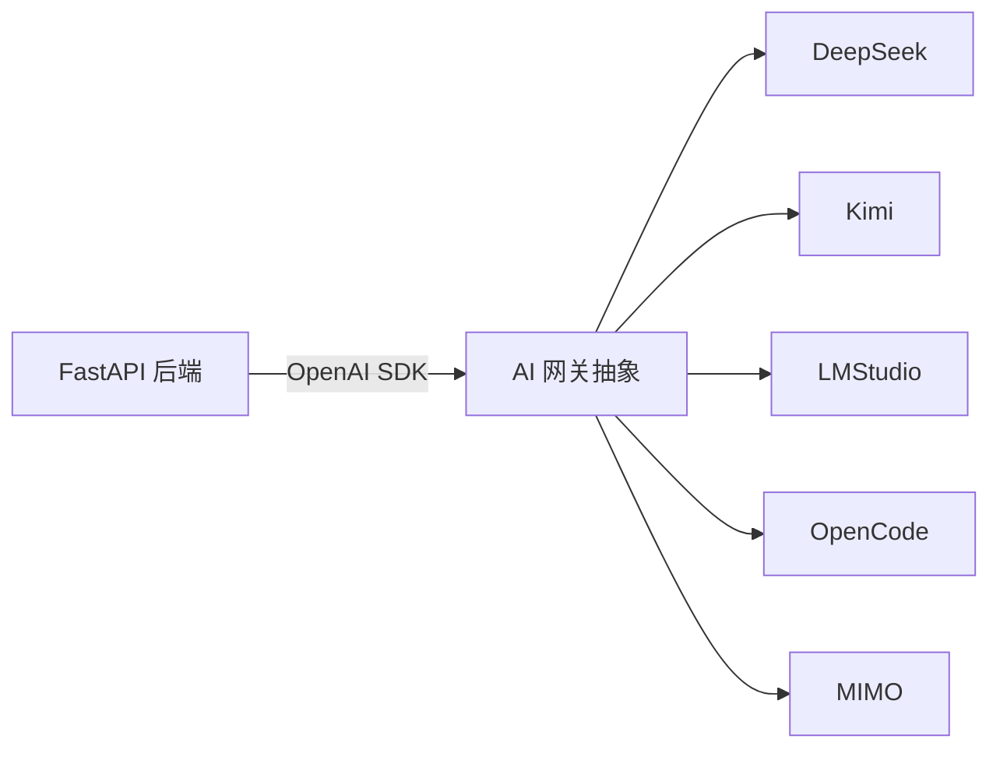

# UniMatch AI 服务

本目录承载 UniMatch 的 AI 网关配置、模型调用策略与本地模型训练说明。

> 当前生产推理通过 OpenAI SDK 兼容层接入 DeepSeek / Kimi / LMStudio / OpenCode / MIMO，无需在此目录部署额外服务。本地模型微调说明仅作为可选扩展路线。

---

## 目录

- [推理架构](#推理架构)
- [支持的 Provider](#支持的-provider)
- [本地模型：使用 LMStudio 推理](#本地模型使用-lmstudio-推理)
- [本地模型微调：QLoRA 微调 Qwen（占位指南）](#本地模型微调qlora-微调-qwen占位指南)
- [训练数据格式](#训练数据格式)
- [参考](#参考)

---

## 推理架构



- 后端通过统一的 `chat.completions` 接口调用 AI。
- 在 `.env` 中通过 `DEFAULT_AI_PROVIDER` 指定默认 provider，并在运行时读取对应 API Key 与 Base URL。
- 生成任务包括：进阶问卷生成、匹配解释、可选的内容审核辅助。

---

## 支持的 Provider

| Provider | 必需环境变量 | Base URL 示例 |
|----------|--------------|---------------|
| DeepSeek | `DEEPSEEK_API_KEY` | `https://api.deepseek.com` |
| Kimi | `KIMI_API_KEY` | `https://api.moonshot.cn/v1` |
| LMStudio | `LMSTUDIO_API_KEY`（可填 `not-needed`） | `http://localhost:1234/v1` |
| OpenCode | `OPENCODE_API_KEY` | 待确认 |
| MIMO | `MIMO_API_KEY` | 待确认 |

---

## 本地模型：使用 LMStudio 推理

1. 安装 [LMStudio](https://lmstudio.ai/) 并下载兼容 OpenAI SDK 的模型（如 `Qwen2.5-7B-Instruct-GGUF`）。
2. 启动模型服务并开启 Local Server（默认端口 `1234`）。
3. 在 `.env` 中设置：

```env
DEFAULT_AI_PROVIDER=lmstudio
LMSTUDIO_BASE_URL=http://localhost:1234/v1
LMSTUDIO_API_KEY=not-needed
LMSTUDIO_MODEL=qwen2.5-7b-instruct
```

4. 后端调用时会自动通过 OpenAI SDK 兼容接口请求本地模型。

---

## 本地模型微调：QLoRA 微调 Qwen（占位指南）

以下是一个基于 `transformers` + `peft` + `bitsandbytes` 的 QLoRA 微调 Qwen 模型的配置与流程示例。本目录不包含训练代码，实际执行时请在独立的训练环境中运行。

### 环境准备

```bash
conda create -n unimatch-qlora python=3.11
conda activate unimatch-qlora
pip install torch transformers datasets accelerate peft bitsandbytes trl
```

### 推荐硬件

- 消费级 GPU：NVIDIA RTX 4090（24GB）可微调 Qwen2.5-7B-Instruct QLoRA。
- 更高参数模型：建议使用 A100 / H100 或 LoRA 更大 rank + 更长训练时间。

### 推荐模型

- 7B 起步：`Qwen/Qwen2.5-7B-Instruct`
- 更优效果：`Qwen/Qwen2.5-14B-Instruct`（需 40GB+ 显存或 DeepSpeed）

### QLoRA 配置示例

```python
from peft import LoraConfig, get_peft_model, TaskType
from transformers import BitsAndBytesConfig

# 4-bit 量化配置
bnb_config = BitsAndBytesConfig(
    load_in_4bit=True,
    bnb_4bit_use_double_quant=True,
    bnb_4bit_quant_type="nf4",
    bnb_4bit_compute_dtype=torch.bfloat16,
)

# LoRA 配置
lora_config = LoraConfig(
    r=64,
    lora_alpha=16,
    target_modules=["q_proj", "k_proj", "v_proj", "o_proj", "gate_proj", "up_proj", "down_proj"],
    lora_dropout=0.05,
    bias="none",
    task_type=TaskType.CAUSAL_LM,
)
```

### 训练流程

1. **加载基础模型**（4-bit）

```python
from transformers import AutoModelForCausalLM, AutoTokenizer

model = AutoModelForCausalLM.from_pretrained(
    "Qwen/Qwen2.5-7B-Instruct",
    quantization_config=bnb_config,
    device_map="auto",
    trust_remote_code=True,
)
tokenizer = AutoTokenizer.from_pretrained("Qwen/Qwen2.5-7B-Instruct", trust_remote_code=True)
model = get_peft_model(model, lora_config)
```

2. **准备数据集**

   将业务数据（如匹配解释、进阶问题生成）转换为 SFT 对话格式。见下方 [训练数据格式](#训练数据格式)。

3. **配置训练参数**

```python
from trl import SFTConfig

training_args = SFTConfig(
    output_dir="./outputs/qwen-unimatch-qlora",
    num_train_epochs=3,
    per_device_train_batch_size=1,
    gradient_accumulation_steps=8,
    learning_rate=2e-4,
    max_seq_length=2048,
    logging_steps=10,
    save_steps=100,
    warmup_ratio=0.03,
    lr_scheduler_type="cosine",
    bf16=True if torch.cuda.is_bf16_supported() else False,
    fp16=not torch.cuda.is_bf16_supported(),
    optim="paged_adamw_8bit",
    group_by_length=True,
)
```

4. **启动训练**

```python
from trl import SFTTrainer

trainer = SFTTrainer(
    model=model,
    tokenizer=tokenizer,
    train_dataset=formatted_dataset,
    args=training_args,
)
trainer.train()
```

5. **合并并导出模型**

```python
merged_model = model.merge_and_unload()
merged_model.save_pretrained("./outputs/qwen-unimatch-merged")
tokenizer.save_pretrained("./outputs/qwen-unimatch-merged")
```

6. **接入 LMStudio**

   将合并后的模型转换为 GGUF 或直接在 LMStudio 加载原始 HuggingFace 格式，配置 `LMSTUDIO_MODEL` 指向本地模型，即可在 UniMatch 后端中使用。

---

## 训练数据格式

UniMatch 微调的 SFT 数据采用对话格式（Qwen 对话模板）：

```json
[
  {
    "messages": [
      {
        "role": "system",
        "content": "你是 UniMatch 的匹配助手，帮助用户生成自然、有趣的匹配解释。"
      },
      {
        "role": "user",
        "content": "用户 A：INTJ，计算机科学与技术，爱好摄影与篮球；用户 B：INTP，计算机科学与技术，爱好摄影与机器学习。请生成 2 句匹配解释。"
      },
      {
        "role": "assistant",
        "content": "你们同是计算机专业，学术路径相近；又在摄影与前沿技术话题上有共同语言，很容易找到深入交流的话题。"
      }
    ]
  }
]
```

数据集来源：

- 用户自愿提交的画像与问卷答案（脱敏后）
- 运营/产品团队标注的高质量匹配解释样本
- 人工构造的进阶问题生成样例

训练前请确保数据经过脱敏、合规审查，并符合《个人信息保护法》及学校相关规定。

---

## 参考

- [Qwen 模型仓库](https://huggingface.co/Qwen)
- [PEFT 官方文档](https://huggingface.co/docs/peft)
- [bitsandbytes 量化配置](https://huggingface.co/docs/transformers/main_classes/quantization)
- [TRL SFTTrainer](https://huggingface.co/docs/trl/sft_trainer)
- [LMStudio Local Server](https://lmstudio.ai/docs/local-server)

---

> 注意：本目录为占位与说明用途，实际训练代码与模型文件不在版本控制中。训练产生的 LoRA 权重、中间 checkpoint 与合并模型应通过 CI/CD 或私有对象存储分发，避免直接提交到 Git 仓库。
